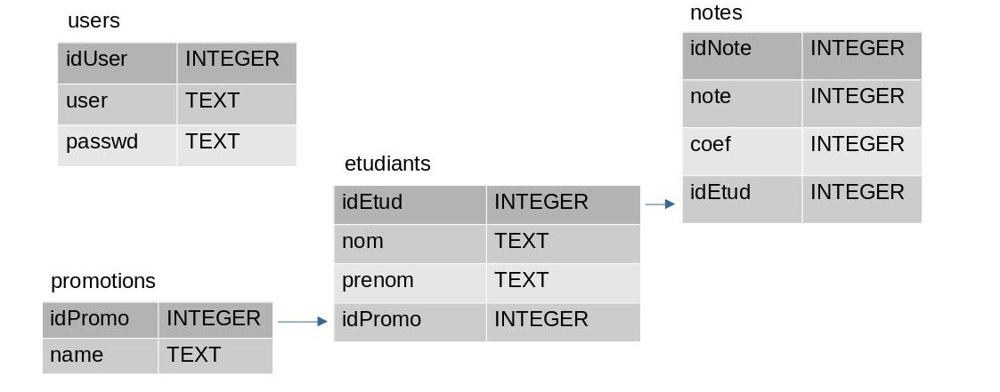

\vspace{2cm}

---

\vspace{2cm}

Durant cette SAE, j'ai pu écrire un service réseau en python à l'aide de
la librairie socket. Le serveur créé permet de gérer des listes de promotions,
d'étudiants et de notes.

\pagebreak

# 1. Structure de la BDD

Comme SGBD, j'ai utilisé sqlite3, car celui-ci a l'avantage d'être simple à utiliser
tout en convenant à mes besoins pour cette SAE.

Voici la structure de ma base de données :



# 2. protocole réseau créé

## a. Structure des requêtes

Pour structurer les requêtes réseau, j'ai décidé d'utiliser du JSON. En effet, cette
structure de données permet d'agencer les données de façon compréhensible.

Les requêtes sont structurées comme ceci :

```json
{
    "op": $COMMANDE,
    "data": $DATA
}
```

La commande est une chaîne de caractères écrite en majuscules. Les différents paramètres de la commande
sont stockés dans un dictionnaire dans le champ data.

## b. Commandes codées

Voici les différentes commandes codées :

 * `NEW_PROMO` : commande créant une nouvelle promotion
     - paramètre :
         - "name" : nom de la promotion

 * `NEW_STUDENT` : commande créant un nouvel étudiant
     - paramètres :
         - "nom" : nom de l'étudiant
         - "prenom" : prénom de l'étudiant
         - "promo": nom de la promotion de l'étudiant

 * `NEW_MARK` : commande ajoutant une nouvelle note à un étudiant
     - paramètres :
         - "note" : valeur de la note
         - "coef" : coefficient de la note
         - "idEtud" : identifiant de l'étudiant

 * `GET_STUDENT_MEAN` : obtenir la moyenne d'un étudiant
     - paramètre :
         - "idEtud" : identifiant de l'étudiant

 * `GET_PROMO_MEAN` : obtenir la moyenne d'une promotion
     - paramètre :
         - "name" : nom de la promotion

 * `GET_STUDENTS_BY_PROMO` : obtenir la liste des étudiants avec leurs notes par promotion
     - paramètre :
         - "promo" : nom de la promotion

 * `CONNECT` : permet au client de s'authentifier
     - paramètres :
         - "user" : nom d'utilisateur
         - "pass" : mot de passe de l'utilisateur

## c. Exemple de requête

Création d'une nouvelle promotion nommée RT1 :

```json
{
    "op": "NEW_PROMO",
    "data": {
        "name": "RT1"
    }
}
```

# 3. Explication du code

## a. Programme serveur

### i. Programme principal

```python
#!/usr/bin/env python3
import socket
import json
import _thread
import bdd
import argparse

parser = argparse.ArgumentParser()
parser.add_argument("--verbose",
                    "-v",
                    help="Rendre le programme bavard",
                    action="store_true")
args = parser.parse_args()

serveur = socket.socket(socket.AF_INET, socket.SOCK_STREAM)
serveur.setsockopt(socket.SOL_SOCKET, socket.SO_REUSEADDR, 1)
serveur.bind(('', 3000))
serveur.listen()

COMMANDS = [
    "NEW_PROMO",
    "GET_STUDENT_MEAN",
    "GET_PROMO_MEAN",
    "NEW_STUDENT",
    "NEW_MARK",
    "GET_STUDENTS_BY_PROMO",
    "CONNECT"
]

while True:
    client, infosclient = serveur.accept()
    _thread.start_new_thread(client_handle, (client, infosclient))

serveur.close()
```

Tout d'abord, nous écrivons les importations de librairies.
La librairie socket nous permettra d'écouter le réseau, JSON
permet de convertir une chaîne de caractères en dictionnaire et inversement.
\_thread permet d'ouvrir un sous-processus de notre programme afin d'éxecuter des
tâches en parallèle. bdd comporte les différentes fonctions d'accès à la base de données,
et enfin, argparse permet de lire les arguments passés lors de l'éxecution du serveur.

Après ces imports, nous définissons les différents arguments utilisables sur le serveur.
L'argument `--verbose` permettra de rendre notre serveur verbeux.

Ensuite, nous définissons un objet socket. Nous précisons avec `socket.AF_INET` que nous allons utiliser
la couche IPv4 et avec `socket.SOCK_STREAM` que nous allons utiliser la couche TCP.
Puis, la ligne suivante permet d'autoriser la réusilisation d'adresse IP (`socket.SO_REUSEADDR`)
au niveau de la couche applicative (`socket.SOL_SOCKET`).

La ligne suivante permet de lier le socket au port 3000 de toutes les interfaces de la machine 
(champ IP vide).

Puis, `socket.listen()` permet de mettre le socket en écoute, et ainsi à le préparer à accepter des
requêtes.

Dans la boucle `while True`, nous ouvrons un nouveau processus éxecutant la fonction  `client_handle`
dès qu'une nouvelle demande de connexion est acceptée.

### ii. Fonction `client_handle`

```python
def client_handle(c, infos):
    if args.verbose:
        print(f"{infosclient} s'est connecté.")

    auth = False
    while True:
        try:
            request = client.recv(1024)
        except:
            if args.verbose:
                print(f"Déconnexion violente de {infos}")
            c.close()
            _thread.exit()
        try:
            request = json.loads(request)
            op = request['op']
            data = request['data']
        except:
            reply_str = json.dumps((1, ""))
            if args.verbose:
                print(reply_str)
            c.send(reply_str.encode())
            continue

        if args.verbose:
            print(f"de {infos} : {request}")

        if request['op'] == "quit":
            if args.verbose:
                print(f"Déconnexion de {infos}")
            c.send(json.dumps((0, "disconnected")).encode())
            c.close()
            _thread.exit()

        else:
            reply = ""
            if op not in COMMANDS:
                code = 3

            elif not isinstance(data, dict):
                code = 1

            elif op == "CONNECT":
                auth = bdd.user_auth(data)
                if not auth:
                    reply = "Connexion impossible"
                    code = 4
                else:
                    reply = "Connecté avec succès"
                    code = 0

            elif auth or op.startswith("GET_"):
                code, reply = handle_request(op, data)

            else:
                code = 5

            str_reply = json.dumps((code, reply))
            if args.verbose:
                print("->", str_reply)
            c.send(str_reply.encode())
```

Cette fonction permet de traiter les données envoyées par le client.
Elle va vérifier si ces données sont bien formées, gérer l'authentification
de l'utilisateur, ainsi que la demande de déconnexion.

Elle renverra alors un couple de valeurs contenant le code d'erreur, puis les données de la réponse.

Voici les différents codes d'erreur possibles :

 * `CODE 1` : Requête malformée
 * `CODE 2` : Données demandées inexistantes
 * `CODE 3` : Commande inconnue
 * `CODE 4` : Identifiants erronés
 * `CODE 5` : Privilèges manquants

Si la commande demandée peut être éxecutée par l'utilisateur, la fonction renvoie la requête à la fonction 
`handle_request` afin que celle-ci génère une réponse.

### iii. Fonction `handle_request`

```python
def handle_request(op, data):
    reply = ""
    code = 1
    if op == "NEW_PROMO": # Commande d'ajout d'une nouvelle promotion
        if "promo" in data:
            bdd.new_promo(data['promo'])
            code = 0

    elif op == "GET_STUDENT_MEAN": # Commande permettant de récupérer la moyenne d'un étudiant
        if "etud" in data:
            if bdd.student_exists(data['etud']):
                reply = bdd.get_student_mean(data['etud'])
                code = 0
            else:
                code = 2

    elif op == "GET_PROMO_MEAN": # Commande permettant de récupérer la moyenne d'une promotion
        if "promo" in data:
            promo_id = bdd.get_promo_id(data['promo'])
            if promo_id == -1:
                code = 2
            else:
                reply = bdd.get_promo_mean(promo_id)
                code = 0

    elif op == "NEW_STUDENT": # Commande d'ajout d'un nouvel étudiant
        if "nom" in data and "prenom" in data and "promo" in data:
            promo_id = bdd.get_promo_id(data['promo'])
            if promo_id == -1:
                code = 2
            else:
                data['promo'] = promo_id
                bdd.new_student(data)
                code = 0

    elif op == "NEW_MARK": # Commande d'ajout d'une nouvelle note
        if "note" in data and "coef" in data and "etud" in data:
            bdd.new_mark(data)
            code = 0

    elif op == "GET_STUDENTS_BY_PROMO":
        if "promo" in data:
            promo_id = bdd.get_promo_id(data['promo'])
            if promo_id == -1:
                code = 2
            else:
                reply = bdd.get_students_by_promo(promo_id)
                code = 0
    else:
        code = 3
    return (code, reply)
```

Cette fonction permet d'éxecuter une fonction de la librairie bdd en fonction de la commande demandée.
De plus, cette fonction vérifie que toutes les données nécessaires à l'éxecution de la requête sont
présentes. Elle renvoie un couple (erreur, données).

## b. Programme d'accès à la base de données

```python
def user_auth(data: dict)->bool:
    con = sqlite3.connect("bdd.db")
    cur = con.cursor()
    params = (data["user"], data["pass"])
    cur.execute("SELECT * FROM users WHERE user=? AND passwd=?;", params)
    result = len(cur.fetchall()) != 0
    con.close()
    return result
```

On sélectionne l'utilisateur `user` ayant comme mot de passe `pass`. S'il y a une entrée, on renvoie `True`,
`False` sinon.

```python
def new_promo(name: str):
    con = sqlite3.connect("bdd.db")
    cur = con.cursor()
    params = (name,)
    cur.execute("INSERT INTO promotions(name) VALUES (?);", params)
    con.commit()
    con.close()
```

On insère une promotion ayant comme nom `name`

```python
def new_student(data: dict):
    con = sqlite3.connect("bdd.db")
    cur = con.cursor()
    params = (data['nom'], data['prenom'], data['promo'])
    cur.execute("INSERT INTO etudiants(nom, prenom, idPromo) VALUES (?, ?, ?);", params)
    con.commit()
    con.close()
```

`data` est le dictionnaire du champ data de la requête.

```python
def new_mark(data: dict):
    con = sqlite3.connect("bdd.db")
    cur = con.cursor()
    params = (data['note'], data['coef'], data['etud'])
    cur.execute("INSERT INTO notes(note, coef, idEtud) VALUES(?, ?, ?)", params)
    con.commit()
    con.close()
```

`data` est le dictionnaire du champ data de la requête.

```python
def get_promo_id(promo: str)->int:
    con = sqlite3.connect("bdd.db")
    cur = con.cursor()
    params = (promo,)
    cur.execute("SELECT idPromo FROM promotions WHERE name=?;", params)
    promo_id = cur.fetchall()
    con.close()
    if len(promo_id) == 0:
        return -1
    else:
        return promo_id[0][0]
```

On récupère un identifiant de promotion en fonction de son nom.
Si la promotion n'existe pas, on renvoie -1.

```python
def get_student_mean(etud: int)->float:
    con = sqlite3.connect("bdd.db")
    cur = con.cursor()
    params = (etud,)
    cur.execute("SELECT note, coef FROM notes WHERE idEtud=?;", params)
    n = 0
    d = 0
    for i in cur.fetchall():
        d += i[1]
        n += i[1]*i[0]
    return n/d
```

On parcourt les notes d'un étudiant afin de calculer sa moyenne pondérée.

```python
def get_promo_mean(promo: int)->float:
    con = sqlite3.connect("bdd.db")
    cur = con.cursor()
    params = (promo,)
    cur.execute("SELECT idEtud FROM etudiants WHERE idPromo=?;", params)
    n = 0
    d = 0
    for i in cur.fetchall():
        n += get_student_mean(i[0])
        d += 1
    con.close()
    return n/d
```

On fait la moyenne des moyennes de chaque étudiant

```python
def get_students_by_promo(promo: int)->list:
    con = sqlite3.connect("bdd.db")
    cur = con.cursor()
    params = (promo,)
    cur.execute("SELECT etudiants.idEtud, nom, prenom, note, coef \
                FROM etudiants \
                JOIN notes ON notes.idEtud = etudiants.idEtud WHERE idPromo=?;", params)
    result = []
    for i in cur.fetchall():
        if i[0] not in [j["idEtud"] for j in result]:
            result.append({"idEtud": i[0], "nom": i[1], "prenom": i[2], "notes": [(i[3], i[4])]})
        else:
            k = 0
            while result[k]["idEtud"] != i[0]:
                k += 1
            result[k]["notes"].append((i[3], i[4]))

    con.close()
    return result
```

On parcourt la liste des étudiants d'une promotion en les joignant avec la liste des notes.
On ajoute alors une entrée dans un tableau si l'étudiant n'est pas dedans. S'il y est,
on ajoute simplement un couple (note, coef) dans le tableau des note de l'entrée de l'étudiant.

```python
def student_exists(idEtud: int)->bool:
    con = sqlite3.connect("bdd.db")
    cur = con.cursor()
    params = (idEtud,)
    cur.execute("SELECT * FROM etudiants WHERE idEtud=?;", params)
    values = cur.fetchall()
    con.close()
    return len(values) == 1
```

On vérifie s'il existe un étudiant ayant comme identifiant celui renseigné en paramètre.

## c. Programme client

```python
#!/usr/bin/env python3
import socket
import json
import getpass

client = socket.socket(socket.AF_INET, socket.SOCK_STREAM)
client.connect(("localhost", 3000))
mes = ""

ERRORS = [
    "Succès",
    "Requête malformée",
    "Données demandées inexistantes",
    "Commande appellée inexistante",
    "Identifiants incorrects",
    "Vous n'avez pas les privilèges pour effectuer cette requête"
]

while mes != "quit":
    mes = input(">")
    op = mes.split(" ")[0]

    if op == "NEW_STUDENT":
        nom = input("Nom de l'étudiant>")
        prenom = input("Prénom de l'étudiant>")
        promo = input("Promotion de l'étudiant>")
        data = {"nom": nom, "prenom": prenom, "promo": promo}

    elif op == "NEW_PROMO":
        name = " ".join(mes.split(" ")[1:])
        data = {"name": name}

    elif op == "GET_PROMO_MEAN":
        promo = mes.split(" ")[1]
        data = {"promo": promo}

    elif op == "GET_STUDENT_MEAN":
        student = mes.split(" ")[1]
        data = {"etud": student}

    elif op == "NEW_MARK":
        student = int(mes.split(" ")[1])
        note = int(input("note de l'étudiant>"))
        coef = int(input("coefficient de la note>"))
        data = {"etud": student, "note": note, "coef": coef}

    elif op == "GET_PROMO_BY_NAME":
        promo = " ".join(mes.split(" ")[1:])
        data = {"promo": promo}

    elif op == "GET_STUDENTS_BY_NAME":
        data = {"promo": promo}

    elif op == "GET_STUDENTS_BY_PROMO":
        promo = " ".join(mes.split(" ")[1:])
        data = {"promo": promo}
        data = {"promo": int(promo)}

    elif op == "CONNECT":
        user = input("login>")
        passwd = getpass.getpass('passwd>')
        data = {"user": user, "pass": passwd}

    elif op == "quit":
        data = ""

    else:
        print("erreur, commande invalide.")
        continue

    json_data = {
        "op": op, # Nom de la commande
        "data": data # Données nécessaires
    }
    client.sendall(json.dumps(json_data).encode()) # Envoi des données
    data = json.loads(client.recv(1024).decode('utf-8'))
    if data[0] == 0:
        print("Résultat:")
        print(data[1])
    else:
        print("erreur, code",data[0])
        print(ERRORS[data[0]])
client.close()
```

En fonction de la commade demandée par l'utilisateur, le programme va lui demander les paramètres nécessaires à son éxecution.
Le client est aussi capable d'interprêter les codes d'erreurs renvoyés par le serveur, et d'afficher les données de la réponse.
